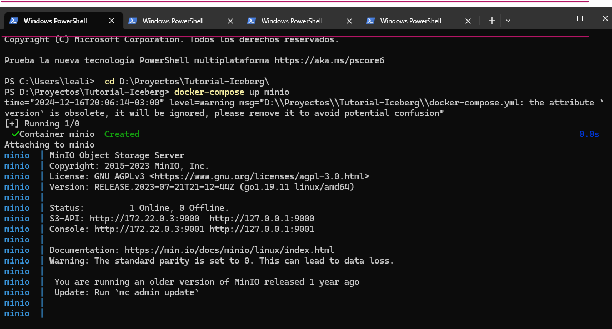
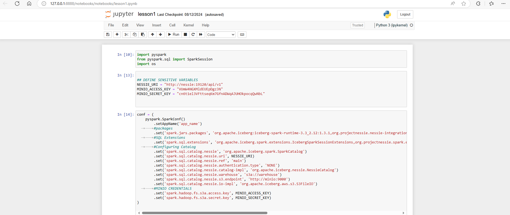
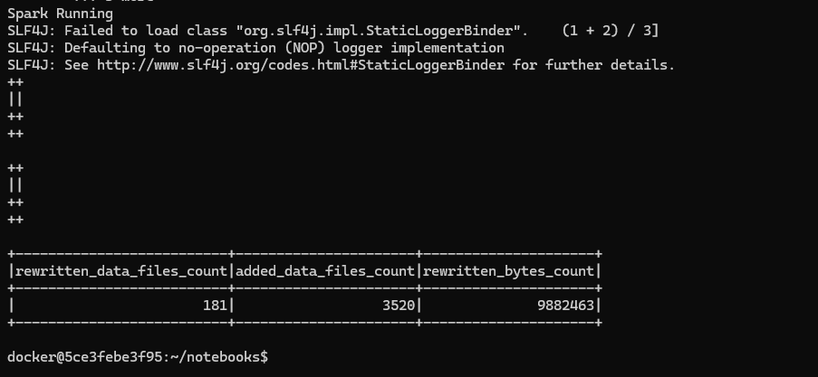

# DataLake with ICEBERG, NESSIE, DREMIO & MINIO using PySpark


```
En este procyecto de Intro de ICEBERG vamos a usar Nessie y Dremio para crear un Delta Lake Local con Docker-Compose e ingesta de datos con PySpark
```

__Links importantes__

1. [Documentación]()
2. [Apache Iceberg 101](https://www.dremio.com/blog/apache-iceberg-101-your-guide-to-learning-apache-iceberg-concepts-and-practices/)
3. [Lessons Code](https://github.com/developer-advocacy-dremio/iceberg-intro-lessons)
4. [Tutorial para construir un Lake House Local](https://dev.to/alexmercedcoder/data-engineering-create-a-apache-iceberg-based-data-lakehouse-on-your-laptop-41a8)

Para poder hacer este Tutorial es necesario __clonar__ el repositorio del punto 3 en un proyecto propio, ya que el mismo contiene el código necesario.
__FORK__ a nuestro repositorio y luego __GIT CLONE URL:REPO__

## Contenido

1. [Creacion del entorno]()
    1. [Estructura de directorios]()
2. [Seteo de Spark y Librerias]()
3. [Ejecución de una notebook]()
    - [Ejecutar desde un cluster de Spark]()
4. [Trabajar con Branching y Merging]()
5. [Trabajar con Partitioning]()


## 1. Creación del entorno

Usamos el Docker-Compose que viene creado junto con el repositorio.
En el mismo tebenos las imagenes de Spark-Notebooks, Dremio, MINIO y Nessie.
__Para tener un mayor control de cada contenedor no vamos a inicializar este proyecto por docker-compose up__ sino que vamos a incializar cada contenedor por __Separado ya que vamos a necesitar las URL de cada uno con el nombre de cada servicio__

creamos tres tabs en el shell
```
docker-compose up notebook
docker-compose up nessie
docker-compose up dremio
docker-compose up minio
```




La estructura de los directorios es.

|directorio|descripcion|
|-|-|
datasets| Contiene los archivos .csv
lesson_code| Contiene el codigo que vamos a ejecutar
notebooks|Contiene las notebooks
warehouse|Es un volumen mapeado en el cluster de Sparr donde podemos guardar data. __En un entorno real usariamos un Storage como MINIO__

Desde una notebbok con spark podemos guardar un archivo en uno de los volumenes mapeados con la siguiente sentencia.

```python
csv_df.write.format('csv').save('/home/docker/warehouse/miData.csv')
```

## 2. Seteo de Spark y Librerias

Para poder usar Spark con Iceberg , MINIO y nessie debemos configurarlo para indicarle donde encontrar cada componente.

```python
import pyspark
import pyspark
from pyspark.sql import SparkSession
import os

## DEFINE SENSITIVE VARIABLES
NESSIE_URI = "http://nessie:19120/api/v1"
MINIO_ACCESS_KEY = "admin"
MINIO_SECRET_KEY = "password"
```

Para poder acceder a MINIO debemos crear un __Bucket__ que en este ejejplo se va a llamar __warehouse__ y debemos crear una clave/valor para poder acceder. Aunque tambien podemos acceder con las credenciales por defecto.

```python
conf = (
    pyspark.SparkConf()
        .setAppName('app_name')
  		#packages
        .set('spark.jars.packages', 'org.apache.iceberg:iceberg-spark-runtime-3.3_2.12:1.3.1,org.projectnessie.nessie-integrations:nessie-spark-extensions-3.3_2.12:0.67.0,software.amazon.awssdk:bundle:2.17.178,software.amazon.awssdk:url-connection-client:2.17.178')
  		#SQL Extensions
        .set('spark.sql.extensions', 'org.apache.iceberg.spark.extensions.IcebergSparkSessionExtensions,org.projectnessie.spark.extensions.NessieSparkSessionExtensions')
  		#Configuring Catalog
        .set('spark.sql.catalog.nessie', 'org.apache.iceberg.spark.SparkCatalog')
        .set('spark.sql.catalog.nessie.uri', NESSIE_URI)
        .set('spark.sql.catalog.nessie.ref', 'main')
        .set('spark.sql.catalog.nessie.authentication.type', 'NONE')
        .set('spark.sql.catalog.nessie.catalog-impl', 'org.apache.iceberg.nessie.NessieCatalog')
        .set('spark.sql.catalog.nessie.warehouse', 's3a://warehouse')
        .set('spark.sql.catalog.nessie.s3.endpoint', 'http://minio:9000')
        .set('spark.sql.catalog.nessie.io-impl', 'org.apache.iceberg.aws.s3.S3FileIO')
  		#MINIO CREDENTIALS
        .set('spark.hadoop.fs.s3a.access.key', MINIO_ACCESS_KEY)
        .set('spark.hadoop.fs.s3a.secret.key', MINIO_SECRET_KEY)
)
```

Una vez establecidos las rutas y los packages podemos instanciar una sesión de Spark y empezar a trabajar.

```python
## Start Spark Session
spark = SparkSession.builder.config(conf=conf).getOrCreate()
print("Spark Running")
```

## 3. Ejecución de notebook.

Para ejecutar una notebook vamos a usar la URL que nos devuelve DOCKER.

```
 http://127.0.0.1:8888/?token=a45239bac50aa5f26d9fb51f6f8fd56ddafe3753ee8a9cc2
 ```

 

 

 __Recordar que la misma puede cambiar con el tiempo__

 Cualquier código que ejecutemos desde esta notebook va a estar conectado al cluster de Spark.

 ## Ejecutar desde un Cluster de Spark

 Si bien la Notebook ejecuta sobre un cluster de Spark y el mismo está configuardo para usar el catalogo Nessie para acceder a las tablas de Apache Iceberg tambien podemos ejecutar un __archivo .py__ directamente dentro del cluster con el mismo resultado.

 - Paso 1.

 Creamos un archivo .py llamado ejecucion_sobre_cluster.py y lo vamos a copiar al contenedor de Spark.

Este archivo hace lo mismo que la notebook pero creamos una nueva tabla en Iceberg. __2024__

- Paso 2

Debemos copiar el archivo desde nuestro equipo al contenedor de Docker donde se guardan los scripts ejecutables.

Ingresamos al contenedor de Spark
---------------------------------

```
docker ps

docker exec -it 5ce3febe3f95 /bin/bash
```

Copiamos el archivo
-------------------

desde nuestro directorio local al contenedor de Spark.

```
docker cp ejecucion_sobre_cluster.py 5ce3febe3f95:/home/docker/notebooks/ejecucion_sobre_cluster.py
```

- Paso 3.

Con el archivo copiado podemos ejecutarlo dentro del cluster de Spark

```
python3 ejecucion_sobre_cluster.py
```



## 4. Trabajar con Branching y Merging

Saber trabajar con Branching en Iceberg y Nessie es muy importante ya que nos permite hacer cambios sin tocar los datos originales y luego hacer Merging si es neecsario o volver a la version original

- Primero debemos tener una View Creada.


```python
df_spark = spark.read.csv('./datasets/df_open_2011.csv').\
    options('header', 'True')
df_spark.createOrReplaceTempView('df_spark')
```

- Segundo creamos la tabla en ICEBERG

```python
spark.sql("CREATE TABLE IF NOT EXISTS nessie.df_open_2023_lesson USING ICEBERG PARTITIONED BY (columna) as SELECT * FROM df_spark OREDR BY \
columna;")
```

- Paso Uno: Creamos una Branch 


```python
spark.sql("CREATE BRANCH IF NOT EXISTS lesson in nessie;")
```

- Paso Dos: Nos posicionamos sobre la Branch __lesson__


```python
spark.sql("USE REFERENCE lesson IN nessie;")
```

- Paso Tres: Hacemos algún cambio


```python
spark.sql("DELETE FROM nessie.df_tabla WHERE columna ='xx';")
```

- Paso Cuatro: Volvemos a la branc original


```python
spark.sql("REFERENCE main IN nessie;")
```

- Paso 5: Si los cambios nos sirven hacemos un MERGING

```python
spark.sql("MERGE BRANCH lesson INTO main IN nessie;")
```

## 5. Trabajar con Partitioning.

Usamos Partitioning cuando queremos organizar los datos de una manera más natural para ser accedidos. Podemos crear una partición desde cero o agregar una partición a una tabla ya particionada.

```
Una vez cargados los datos en un DataFrame de Spark y creada la vista Temporal podemos crear una tabla de ICEBERG con las particiones que querramos.
```

A una tabla existente vamos a agregar una nueva partición.

```python
spark.sql("ALTER TABLE nessie.df_open_2023_lesson3 ADD PARTITION FIELD truncate(1, columna);")
```

Para que estos cambios sean efectivos es necesario __REESCRIBIR LA TABLA__ usando el método __CALL PROCEDURE__

```python
spark.sql("CALL nessie.system_rewrite_data_files ('df_open_2023_lesson2')").show()
```

```
En este ejemplo vamos a hacer una repartición de todo el set de datos  
pero tambien podemos particionar solo una partición específica lo que sería igual a una SUBPARTICION.
Por ejemplo a la Particion de US (Estados Unidos) podemos agregarle una SubPartición por Edad.
```


## Directions


1. [Find Guides and Tutorials Here](https://github.com/developer-advocacy-dremio/quick-guides-from-dremio)
2. [Cómo contruir un Lake House Local](https://dev.to/alexmercedcoder/data-engineering-create-a-apache-iceberg-based-data-lakehouse-on-your-laptop-41a8)
